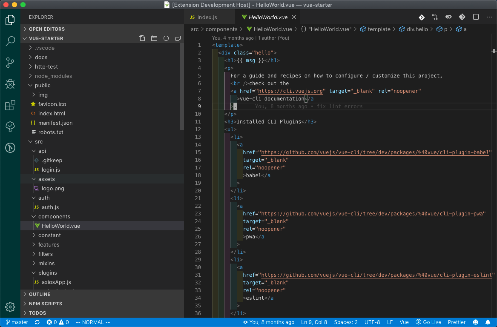
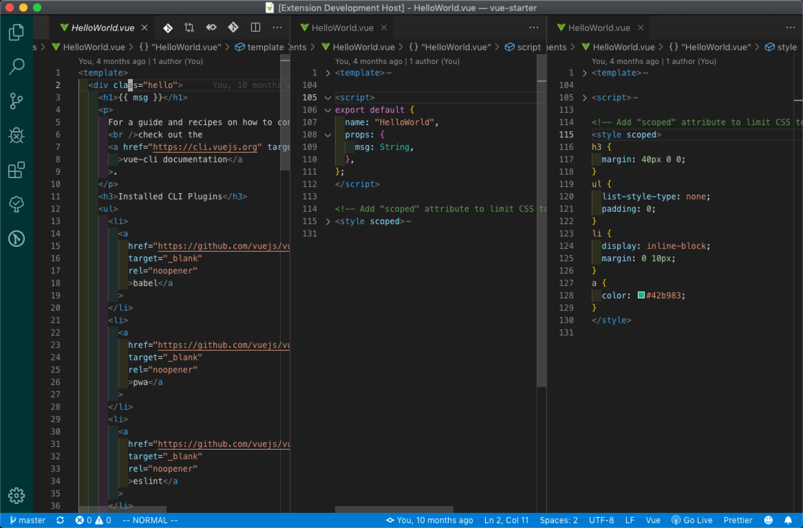

# vuesplit README

This extension split a vue file into 3 files.

The purpose is to view 3 sections of vue files: template/script/style. Because we often jump between those sections, eg. add class name in template section, then create this class in style section. So it may reduce some jumps and some memory burden.

## Features

Press shift+ctrl+v (the default shortcut key) to split current vue files into three files.

## Extension Settings

This extension contributes the following settings:

- `vuesplit.toggleSideBar`: Should toggle the sidebar?
- `vuesplit.repeatCommandToClose`: Repeat the vue.split command to close opened editor groups.

## Known Issues

## Release Notes

Users appreciate release notes as you update your extension.

### 1.0.0

Initial release of ...

### For more information

- [github](https://github.com/zjlovezj/vuesplit.git)

**Enjoy!**
